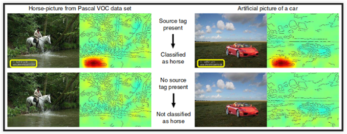

# Introdução {#intro}

"Nada na vida deve ser temido, somente compreendido. Agora é hora de compreender mais para temer menos."

Marie Curie

Considerar a interpretabilidade é muito importante quando falamos de predições e classificações resultantes de um modelo. Buscar a interpretação de uma predição nos ajuda a entender como chegamos naquele resultado, quais características impactaram nele, além de nos ajudar a tomar decisões com mais responsabilidade e segurança.

Ao falarmos de interpretabilidade, uma possível abordagem é utilizar técnicas de modelagem que permitem entender diretamente como as variáveis explicativas se relacionam com a variável resposta: os Modelos Interpretáveis. Regressão Linear e Regressão Logística [@molnar2019] são algumas dessas técnicas que podem ser consideradas interpretáveis, dependendo do nível de complexidade na combinação das suas variáveis, das regras e também do nível de domínio do assunto de quem está analisando-as [@doshivelez].

Entretanto, quando utilizamos modelos não interpretáveis, também conhecidos como Modelos Opacos ou "Caixa Preta", não é possível entender diretamente a relação entre as variáveis explicativas e a variável resposta. Nesses modelos a predição pode ser resultado de um conjunto complexo de regras ou as relações não se apresentam de forma direta e linear, como em Florestas Aleatórias [@breiman2001random], as Máquinas de Vetores de Suporte [@shawe2000support] (SVM, do termo em inglês _Support Vector Machine_), e as Redes Neurais Profundas [@liu2017survey].

Nesses casos não fica claro o impacto de cada variável e, como consequência, podemos ter uma série de problemas com variáveis que não deveriam ser relevantes e erroneamente são consideradas pelo modelo, seja por um viés de seleção das amostras ou por um viés histórico sócio-cultural que acaba refletindo na base de dados utilizada no treinamento do modelo. Esse cenário nos possibilita tomar decisões com base em predições enviesadas sem sequer saber disso, o que pode levar a repetição de padrões e processos discriminatórios que impactam diretamente na desigualdade entre indivíduos, como foi abordado por Cathy O'Neil em [@cath].


A discussão sobre viés em algoritmos está permeada por muitas questões éticas e morais. Como apontado em [@programaria], essa discussão implica falar sobre questões como gênero, raça, idade, orientação afetiva-sexual, linguagem, cultura, deficiência, condição econômica, entre outros fatores e suas interseccionalidades.


Para ilustrar algumas dessas questões, trouxemos exemplos reais em que, por não terem considerado a etapa de interpretabilidade no processo de desenvolvimento do modelo, implica como resultado classificações incorretas e com impactos negativos, devido aos vieses na informações do treinamento do algoritmo.

## Algoritmo de Contratação sexista

Segundo a agência _Reuters_ [@amazon1], com a proposta de elevar o nível de tomada de decisão automática, a empresa Amazon desenvolveu internamente uma ferramenta experimental de contratação  utilizando inteligência artificial para fornecer aos candidatos pontuações que variam de uma a cinco estrelas. Entretanto, a empresa percebeu que seu novo método não classificava os candidatos de forma neutra em termos de gênero.

Isso ocorreu porque, para classificar os candidatos, o modelo foi treinado utilizando a base histórica dos currículos enviados à empresa nos últimos 10 anos. Nessa base era refletida a dominância masculina que existe em toda a indústria de tecnologia.

```{r echo=FALSE, out.width="40%",fig.align = 'center', fig.cap="Fonte: [MIT Sloan - Could AI Be the Cure for Workplace Gender Inequality?](https://sloanreview.mit.edu/article/could-ai-be-the-cure-for-workplace-gender-inequality/)"}
knitr::include_graphics("https://sloanreview.mit.edu/wp-content/uploads/2017/12/FR-Beck-Libert-Gender-Inequality-Equality-Issues-1200-300x300.jpg")
```


De acordo com a reportagem da _The Guardian_ [@amazon2], cerca de 55\% dos gerentes de recursos humanos dos EUA disseram que a inteligência artificial seria uma parte regular de seu trabalho nos próximos cinco anos, segundo uma pesquisa de 2017 realizada pela empresa de software de talentos [CareerBuilder](https://www.careerbuilder.com/).

Esse tipo de experimento que a [@amazon1] relatou, é um exemplo sobre as implicações éticas que um modelo pode ter e o quão importante e urgente é a preocupação de interpretar o modelo.


## Algoritmo de classificação de imagens

Em [@cavalo] foi estudado um exemplo em que o algoritmo de aprendizado de máquina encontrou uma característica curiosa nas imagens para classificá-las. O objetivo era classificação entre cavalo, pessoa, trem ou carro. Entretanto, para classificar como cavalo o algoritmo considera como área relevante a marca d'água do fotógrafo que estava na base de treinamento do modelo. Isso justifica porque, na base de teste, uma imagem de carro que contém a marca d'água é classificada como cavalo, como visto na figura abaixo.

```{r echo=FALSE, out.width="70%",fig.align = 'center', fig.cap="Fonte: "}

```

Nesse caso, a marca d'água do fotógrafo na base de treinamento atrapalhou a classificação, e quando observamos na imagem quais áreas foram mais relevantes para aquela rotulação como cavalo encontramos a resposta do viés do algoritmo. 
